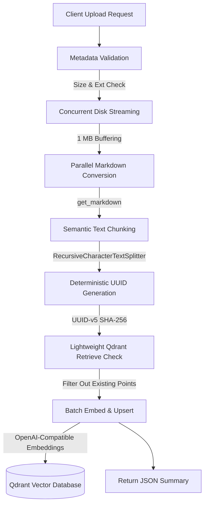

# THE RAG API

A high-performance, resilient FastAPI service designed to ingest documents of various formats, parse them into Markdown, segment them semantically, and upsert their dense vector representations into Qdrant.

It serves as the ingestion component of the **Model Context Protocol (MCP) RAG Server** ecosystem, enabling client applications to index documents and perform fast semantic search queries.

---

## 🚀 Key Features

- **Universal Document Ingestion**: Converts complex file formats (PDFs, Office docs, notebooks, audio, images, source code, etc.) to Markdown using `any-to-markdown`.
- **Idempotent Deduplication**: Generates deterministic UUID-v5 keys based on chunk content hashes (SHA-256). Pre-existing vector points are skipped to save API costs and database storage.
- **O(1) Memory Footprint**: Large files are streamed to disk in 1 MB chunks to maintain low, flat RAM usage regardless of file scale.
- **Highly Concurrent**: Parallelizes file saves and markdown conversion tasks using asynchronous event loops (`asyncio`).
- **Auto-Provisioning**: Dynamically queries embedding dimension at boot and automatically creates the target Qdrant collection using Cosine distance if it does not exist.
- **Connection Pooling & Singletons**: Reuses heavy resources (Qdrant client TCP socket pool, text splitters, and embedding models) throughout the lifecycle of the FastAPI application.

---

## 🏗️ Architecture & Pipeline Flow

The diagram below illustrates the ingestion pipeline triggered by every file upload request:



---

## 🛠️ Configuration & Environment Variables

Create a `.env` file in the root of the API directory using the template below:

| Environment Variable           | Description                                              | Example / Default                                 |
| ------------------------------ | -------------------------------------------------------- | ------------------------------------------------- |
| `QDRANT_URL`                   | The endpoint URI of your Qdrant cluster/instance.        | `https://xyz-example.eu-central.qdrant.tech:6333` |
| `QDRANT_API_KEY`               | Authorization API key for your Qdrant instance.          | `your-secure-api-key`                             |
| `QDRANT_COLLECTION_NAME`       | The collection namespace to store and search embeddings. | `RAG`                                             |
| `EMBEDDING_MODEL_NAME`         | The name of the OpenAI-compatible embedding model.       | `text-embedding-3-small`                          |
| `BASE_URL_FOR_EMBEDDING_MODEL` | Custom target URL for OpenAI-compatible API endpoints.   | `https://api.openai.com/v1`                       |

---

## 📦 Setup & Installation

The application is managed using **uv**, a fast Python package installer and resolver.

### 1. Prerequisites

Ensure you have Python 3.11+ and `uv` installed. If you do not have `uv`, install it via:

```bash
curl -LsSf https://astral.sh/uv/install.sh | sh
```

### 2. Synchronize Virtual Environment

To create a virtual environment and synchronize dependencies, run:

```bash
uv sync
```

### 3. Run Ingestion API Server

Launch the FastAPI server using the workspace launcher or run it directly with Uvicorn:

```bash
uv run uvicorn main:app --host 0.0.0.0 --port 8000 --reload
```

---

## 🔌 API Documentation

### Ingest Documents and Store Embeddings

- **Endpoint**: `POST /store-embeddings`
- **Content-Type**: `multipart/form-data`
- **Request Payload**: One or more files (`files: UploadFile`)

#### Example Request (cURL)

```bash
curl -X POST "http://localhost:8000/store-embeddings" \
  -H "accept: application/json" \
  -H "Content-Type: multipart/form-data" \
  -F "files=@document.pdf" \
  -F "files=@notes.txt"
```

#### Example Response (200 OK)

```json
{
  "status": "completed",
  "total_files": 2,
  "successful": 2,
  "failed": 0,
  "total_chunks": 45,
  "new_chunks": 12,
  "skipped_chunks": 33,
  "details": [
    {
      "input": "document.pdf",
      "status": "success",
      "error": null
    },
    {
      "input": "notes.txt",
      "status": "success",
      "error": null
    }
  ]
}
```

#### Response Fields

- `status` (string): Pipeline execution status.
- `total_files` (integer): Total number of files uploaded.
- `successful` (integer): Number of files successfully processed.
- `failed` (integer): Number of files that failed parsing/conversion.
- `total_chunks` (integer): Number of overlapping chunks generated.
- `new_chunks` (integer): Number of chunks vectorized and upserted.
- `skipped_chunks` (integer): Number of chunks skipped due to pre-existing hashes.
- `details` (list): Detailed breakdown of the processing status for each uploaded file.
